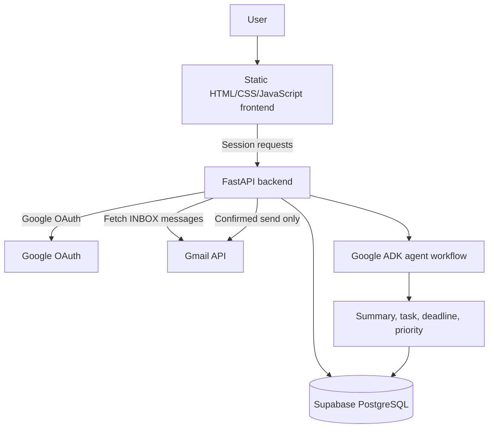
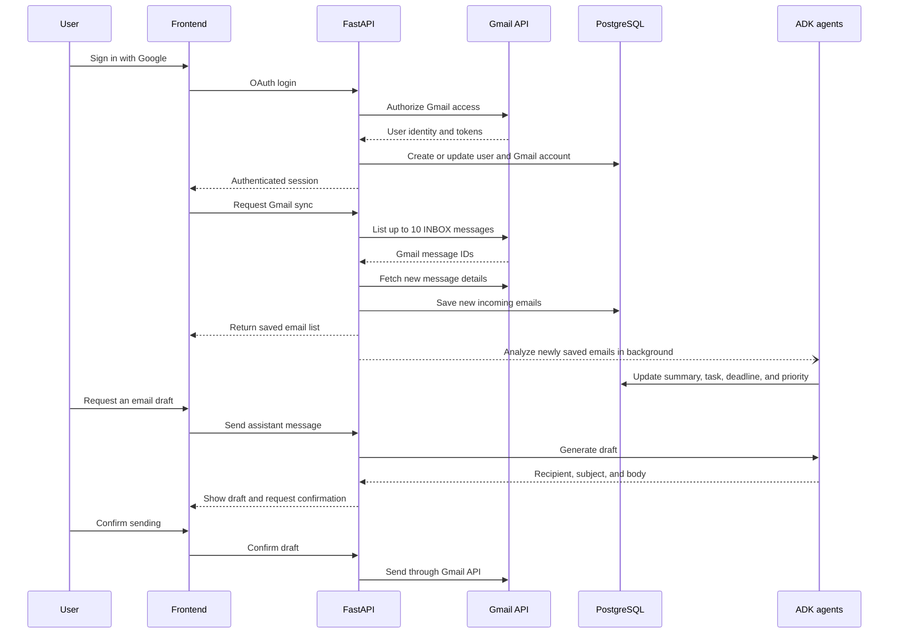

# InboxAI

InboxAI is an AI-powered email workspace that turns an incoming Gmail inbox into clear summaries, prioritized action items, and deadlines. It combines Google OAuth, Gmail synchronization, PostgreSQL storage, FastAPI services, and Google ADK agents in one focused workflow.

## Why InboxAI?

Important email information is easy to miss when messages are scattered across a busy inbox. A user may need to identify the purpose of a message, decide its urgency, remember a deadline, create a task, and write a reply before taking action.

InboxAI reduces that manual work by analyzing incoming messages and presenting the information that requires attention in a structured dashboard.

## Main Features

- **Google authentication** with session-based login and Gmail account connection.
- **Inbox synchronization** that imports up to 10 messages labeled `INBOX` from the connected Gmail account.
- **Duplicate protection** using the Gmail account and Gmail message ID.
- **AI email analysis** that extracts:
  - A concise summary
  - An actionable task, when one exists
  - A normalized deadline
  - A priority level: High, Medium, or Low
- **Task management** for tasks extracted from analyzed emails, including pending/completed status and soft deletion.
- **Deadline tracking** that groups extracted deadlines by priority.
- **AI Assistant** for questions about the inbox and email-related requests.
- **Safe email drafting** with explicit confirmation before an email is sent through Gmail.
- **Responsive frontend** with dashboard, inbox, tasks, deadlines, and assistant views.

## Architecture



### Backend

The backend is a FastAPI application in `InboxAi_Backend/server.py`. It handles authentication, session validation, Gmail synchronization, email retrieval, task status changes, soft deletion, AI assistant requests, and confirmed email sending.

Database access is provided through SQLAlchemy in `InboxAi_Backend/database.py`. Records are isolated by the authenticated user's Gmail account.

### AI workflow

The Google ADK workflow in `InboxAi_Backend/agents/agent.py` contains:

1. An email-understanding agent that extracts summary, task, and deadline.
2. A priority agent that assigns High, Medium, or Low priority.
3. An email workflow that sequences the analysis agents.
4. An orchestrator that routes email-management requests and assistant conversations.
5. A send-mail agent that prepares drafts without sending them directly.

Email analysis is saved on the corresponding email record using the existing fields `summary`, `task`, `deadline`, and `priority`.

## Email Workflow



New Gmail messages are saved before AI analysis completes, allowing the frontend to display the inbox sooner. Background analysis still updates the existing analysis fields after the sync response is returned.

## Project Structure

```text
InboxAI/
├── InboxAi_Backend/
│   ├── server.py                  # FastAPI application and routes
│   ├── database.py                # SQLAlchemy/PostgreSQL connection
│   ├── agents/agent.py            # Google ADK analysis workflow
│   ├── send_mail_agent/           # Drafting and Gmail delivery
│   ├── tools/tools.py             # ADK tools
│   ├── migrations/                # SQL migrations
│   ├── pyproject.toml
│   └── requirements.txt
├── InboxAI_frontend/
│   ├── index.html
│   ├── script.js
│   └── style.css
├── requirements.txt
└── README.md
```

## API Surface

| Endpoint | Purpose |
| --- | --- |
| `GET /auth/google/login` | Start Google OAuth |
| `GET /auth/google/callback` | Complete OAuth and create the application session |
| `GET /auth/me` | Return the current authenticated user |
| `POST /auth/logout` | Clear the current session |
| `GET /gmail/emails` | Sync up to 10 incoming `INBOX` messages |
| `GET /emails` | Return the user's non-deleted emails |
| `POST /emails/{email_id}/analyze` | Analyze and save an existing email |
| `PATCH /emails/{email_id}/status` | Mark an email task as `Pending` or `Completed` |
| `DELETE /tasks/{task_id}` | Soft-delete an email from InboxAI |
| `POST /analyze` | Use the AI Assistant and manage confirmed email drafts |
| `GET /` | Backend health response |

## Local Setup

### Requirements

- Python 3.12 or newer
- A PostgreSQL-compatible Supabase database
- Google OAuth credentials with the configured Gmail scopes
- Google ADK/Gemini configuration

### Install dependencies

```bash
git clone https://github.com/Hendmostafa44/InBoxAi.git
cd InBoxAi/InboxAi_Backend
python -m venv .venv
```

On Windows:

```powershell
.venv\Scripts\Activate.ps1
```

Install backend dependencies:

```bash
pip install -r requirements.txt
```

### Configure environment variables

Configure the backend environment with the required Google OAuth, session, and Supabase database values. Keep credentials in `.env` files that are excluded from version control.

Typical values include:

```env
GOOGLE_CLIENT_ID=your_google_client_id
GOOGLE_CLIENT_SECRET=your_google_client_secret
GOOGLE_API_KEY=your_google_api_key
GOOGLE_REDIRECT_URI=http://localhost:8007/auth/google/callback
FRONTEND_URL=http://localhost:5500/InboxAI_frontend/index.html
SESSION_SECRET_KEY=replace_with_a_secure_random_value
SUPABASE_DB_USER=your_database_user
SUPABASE_DB_PASSWORD=your_database_password
SUPABASE_DB_HOST=your_database_host
SUPABASE_DB_PORT=5432
SUPABASE_DB_NAME=your_database_name
```

Never commit OAuth secrets, API keys, database passwords, or session secrets.

### Run the backend

From `InboxAi_Backend`:

```bash
uvicorn server:app --reload --host 0.0.0.0 --port 8007
```

### Serve the frontend

From the repository root, serve the static frontend with VS Code Live Server or:

```bash
python -m http.server 5500 --directory InboxAI_frontend
```

Open `http://localhost:5500/index.html` when using that command, or use the URL provided by your static server.

## Security and Data Isolation

- Google OAuth state and PKCE verification protect the OAuth callback flow.
- Session authentication is required for user data endpoints.
- Email reads, analysis, task status changes, and soft deletion are scoped to the authenticated user's Gmail account.
- Email sending requires an explicit confirmation message after a draft is shown.
- SQL statements use bound parameters.
- Secrets must be supplied through environment variables and must not be committed.

## Current Scope

InboxAI currently focuses on incoming Gmail messages and tasks extracted from those messages. Manual task creation is not included. The repository does not currently include automated tests or CI configuration, so production deployments should add focused coverage for OAuth, user isolation, Gmail synchronization, AI response parsing, and email-send confirmation.

## License

No license file is currently included in the repository.